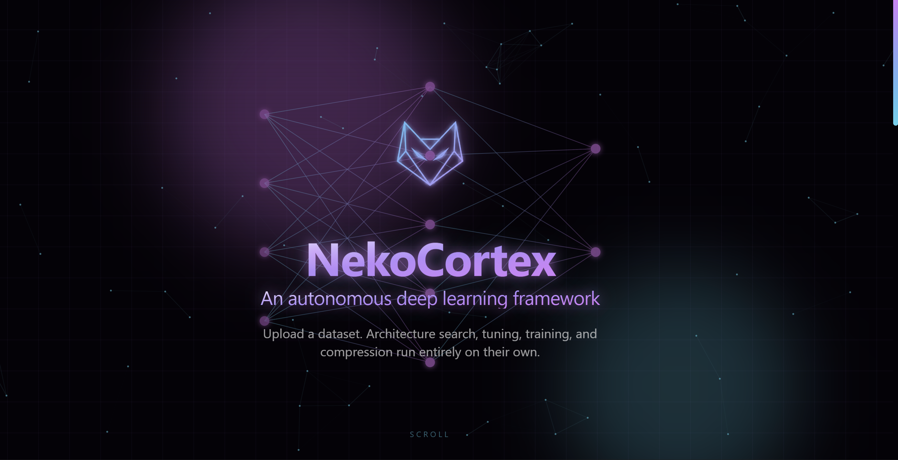

<div align="center">

# 👾 NekoCortex 🌿

### An autonomous deep learning framework

Upload a dataset. Architecture search, tuning, training, and compression run entirely on their own.

[**Live Demo**](https://nekocortex.vercel.app/) · [Backend Repo](https://github.com/NekoTensor/AutoML-Backend)

</div>

<br/>



<br/>

## What this is

NekoCortex is the frontend for a real, working AutoML pipeline — not a themed mockup. Upload a CSV, pick a task type and target column, and watch five real ML stages run live over a WebSocket:

1. **Understand** — dataset validation, class-balance detection, synthetic oversampling for imbalanced targets
2. **Search & Tune** — a shortlist of neural architectures trained and ranked, then hyperparameter search (Optuna TPE) on the winner
3. **Train** — full training with live overfitting detection that adjusts dropout/learning rate mid-run, and automatic best-checkpoint restoration
4. **Compress** — pruning → knowledge distillation → int8 quantization → ONNX export

At the end you get a trained ONNX model, a full JSON report, and a self-contained Jupyter notebook documenting the exact run — all downloadable.

This repo is the presentation layer. The actual pipeline (FastAPI + PyTorch) lives in [AutoML-Backend](https://github.com/NekoTensor/AutoML-Backend) and is deployed separately on Hugging Face Spaces.

## Design

Dark, cyberpunk-purple, scroll-driven storytelling built with:

- **Next.js 15** (App Router) + **TypeScript**
- **Tailwind CSS** for styling
- **GSAP** (`ScrollTrigger`) for scroll-scrubbed and entrance animations
- **Lenis** for inertia/momentum scrolling
- A hand-traced vector logo (contour-extracted from original artwork via OpenCV) and a canvas-based particle field, both themed to the site's exact cyan-to-magenta gradient

Every animation checks `prefers-reduced-motion` and falls back to a static, fully-visible layout — this isn't an afterthought bolted on at the end, it was part of every visual iteration.

## Project layout

```
automl-ui/
├── app/
│   ├── layout.tsx       # root layout — mounts global background/scroll effects
│   ├── page.tsx         # assembles Hero → ScrollySteps → UploadCard → PhaseFeed → Dashboard
│   ├── globals.css      # theme tokens, glassmorphism, reduced-motion fallback
│   └── icon.svg         # browser tab favicon
├── components/
│   ├── Hero.tsx             # autoplay network intro, logo, heading
│   ├── LogoMark.tsx         # vector logo (traced from original artwork)
│   ├── ParticleField.tsx    # persistent full-page canvas particle layer
│   ├── AmbientBackground.tsx # grid/scanline/glow-orb background
│   ├── SmoothScroll.tsx     # Lenis + GSAP ticker integration
│   ├── ScrollySteps.tsx     # 4-step pipeline explainer
│   ├── UploadCard.tsx       # the actual functional upload/config form
│   ├── ThemedSelect.tsx     # custom dropdown (native <select> can't be restyled)
│   ├── PhaseFeed.tsx        # live 5-phase progress display
│   ├── PhaseCard.tsx        # shared glass card shell
│   ├── LiveLog.tsx          # auto-scrolling log with per-line animation
│   ├── Dashboard.tsx        # final downloads (ONNX / report / notebook)
│   └── MagneticButton.tsx   # cursor-following hover effect
└── lib/
    ├── config.ts             # backend API/WebSocket URL (env-driven)
    ├── types.ts              # TS types mirroring the backend's WS event contract
    ├── pipelineReducer.ts    # maps each WS event onto UI state
    ├── useAutoMLPipeline.ts  # upload + WebSocket hook
    └── gsap.ts               # ScrollTrigger registration, reduced-motion check
```

## Setup

```bash
git clone https://github.com/NekoTensor/AutoML-Frontend.git
cd AutoML-Frontend
npm install
cp .env.local.example .env.local
```

Edit `.env.local` to point at a running backend:

```
NEXT_PUBLIC_API_URL=http://127.0.0.1:8000
```

(Or the deployed HF Space URL — see [AutoML-Backend](https://github.com/NekoTensor/AutoML-Backend) for how to run it.)

```bash
npm run dev
```

Open **http://localhost:3000**.

## Deployment

This is deployed on **Vercel**, connected directly to this GitHub repo — every push to `main` redeploys production, every PR gets a preview URL automatically. The only required environment variable in the Vercel project settings is:

- `NEXT_PUBLIC_API_URL` — the deployed backend's URL

See `CONTRIBUTING.md` for the full fork → PR → merge → live flow.

## Known gaps

- **No inertia on the pipeline's own animated elements during a run** — Lenis smooths page scroll, but doesn't affect the WebSocket-driven live log/progress bars, which is intentional (those need to render in real time as events arrive).
- **"Run Inference" isn't wired up yet** — the pipeline exports a working ONNX model, but there's no UI yet to load it back and run predictions against new rows.
- **No automated tests.** Every bug caught so far (a recurring NaN-serialization issue, an ONNX exporter dependency, a couple of indentation mishaps) was caught by manual testing, not CI. A good first contribution.
- **Single active run at a time** — there's no queueing or multi-user session handling; this is a demo-scale app, not yet a multi-tenant product.

## License

MIT — see `LICENSE`.

## Contributing

See `CONTRIBUTING.md`. Public repo, PRs welcome.
